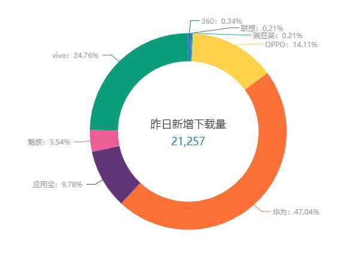

你是「foodie」新入职的产品助理，现在上司让你去收集最近90天的用户反馈，你需要在下一次内部会议上进行做汇报。作为你的入职第一战，是时候给大家展现你的能力了~

整理「foodie」在各大应用商店的用户反馈

1. 一共找到至少30条用户的有效反馈。
2. 对用户反馈进行分类，并进行简要分析。
3. 根据分析结论，总结出相应的行动计划建议。

> 整理的用户评论表格如下：

|     来源     | 评分 | 手机型号 | 版本号 |                           评论内容                           |                 问题点                 |
| :----------: | :--: | :------: | :----: | :----------------------------------------------------------: | :------------------------------------: |
|   AppStore   |  2   |          |  2.0   | 总是弹出提醒所以下了这个新的app，功能一毛一样就算了，比之前的还难用。旧版本打开的时候是停留在上一个使用的滤镜，新版本打开的时候滤镜都是YU3，作为固定使用某一两个滤镜的人来说，每次还要手动切换滤镜的体验实在太糟糕了。而且打开速度依然够慢。旧版本在商店里已经下架搜不到了，但是新版本如果一直这样下去，我是会卸载继续用旧版的。 | 强制更新、新功能通知不到位、使用不习惯 |
|   AppStore   |  2   |          |  2.0   | 本来彩铅画我觉得还不够美丽啊，还应该做好看一点，可是更新之后，突然就没有彩铅画了，差评啊 |                功能缺失                |
|   AppStore   |  3   |          |  2.0   | 软件本来用着挺好。结果2月突然提示，不更新软件不能用。更新了，发现每次打开app都提示一个小框，上面有view和end两个按键。点了end，软件自动关闭，更拍不了照。点了view，必须跳转到app store，然后必须再点打开二字，才能重新进入app和拍照？？？？？？而且有时候软件会闪退，拍照后延迟显示。更喜欢更新前，把模糊的功能放在拍摄页面。最后，如果每次拍照要这么麻烦，那只能弃坑了…app本身还是很好的，望尽快改善！ |       更新方式不合理、使用不习惯       |
|   AppStore   |  4   |          |  2.0   | 其他都还好，就是录像是1分钟，但是不到1分钟就锁屏了，就黑了，就得重新录了，也不保存黑屏之前的，以前的版本就很好可以一直录，这录像时候还总得点几下屏幕，忘了点就完了，白录 |             功能设计不人性             |
|   AppStore   |  1   |          | 2.0.5  | 之前滤镜调整都有数值 要调多少清晰明了 怎么今天用滤镜数值条突然就没有数字了 越更新越不好了 |             更能设计不人性             |
|   AppStore   |  1   |          | 2.0.5  |                     修五张照片闪退一次！                     |                应用闪退                |
|   AppStore   |  4   |          | 2.1.0  | 1、非常不满意捆绑下app的行为。 2、很不喜欢不能去掉水印的行为，你可以出一个付费版，选择是否去掉水印，水印真的很影响拍照。 3、麻烦有个官方微博。  四星给滤镜 |          对运营不满、功能缺失          |
|   AppStore   |  1   |          | 2.1.0  | 基本等于用不了了，打开拍一张就闪退，拍的那咋还没存上。每次拍照片，等着他存都要等半天。第一次想骂一个软件laji。 |                性能不好                |
|   AppStore   |  3   |          | 2.1.0  | 不懂为什么相册里有的照片在做滤镜的时候又没有，而且为什么凑近了下面就直接黄了，导致点哪里都是拍照。以前的凑近了也可以滑动换滤镜，现在每次都要离远了换完了再凑近，太麻烦了。以前的版本好用太多，后悔升级 |                功能缺陷                |
|   AppStore   |  4   |          | 2.1.0  | 现在的版本拍完照不自动保存相册了？而且最近出现拍完照有闪退的现象 程序修复一下 |          使用不习惯、性能不好          |
|   AppStore   |  3   |          | 2.1.1  |   不知道为什么，经常性闪退，然后就要重新拍照，内存网络都ok   |                性能不好                |
|   AppStore   |  2   |          | 2.1.1  | 卡的要命！！老是闪退！以前挺好用的，最近几个月是怎么了？？？？拍个照要反应好久！然后直接闪退！都卸了重下过了还是这样！！！！ |                性能不好                |
|   AppStore   |  3   |          | 2.1.1  | 强制更新，不更新不能用。点更新连不到网页。直接在应用商店搜又要验证码。验证码非常难以辨认。输入验证码还是更新不成功……我不就是要用个拍照软件嘛……至于么……输了无数次指纹……还没下好 |             更新过程不顺畅             |
|   AppStore   |  3   |          | 2.1.1  | 如题，经常打开后只有快门按钮，无法更换滤镜，除了取景框任何地方一点就是拍照（题：bug太多了） |                  bug                   |
|   AppStore   |  5   |          | 2.1.1  |      拍摄的图片或者加载的图片在调整滤镜时经常闪退！！！      |                性能不好                |
| 华为应用商店 |  2   |  Mate9   | 2.0.1  |      新版本变得不好用了，每次都要重新更改默认保存文件夹      |              不习惯新设置              |
| 华为应用商店 |  4   |   P10    | 2.0.2  | 今天拍照没有美颜了，按下快门一闪黑了，还会拍出黑色的。。。不知怎么回事，使用感比以前的旧版本差很多了。 |             bug、图片偏黑              |
| 华为应用商店 |  1   | 荣耀V10  | 2.0.2  | 滤镜质量感觉比以前旧版本的差了很多 按下快门的时候会闪黑 而且照出来根本和滤镜一不一致 在线等 |            bug、图片效果差             |
| 华为应用商店 |  1   |  nova2s  | 2.1.1  |         为什么拍摄延迟，明明是很亮的滤镜，拍出来黑暗         |             bug、图片偏黑              |
| 华为应用商店 |  1   |  nova2s  | 2.2.0  |    为什么效果变暗了 不管怎么拍都是暗的 为什么为什么为什么    |             bug、图片偏黑              |
| OPPO应用商店 |  1   |          | 2.0.1  | 完全没有旧版好用……而且保存图片的文档还和原来的是不一样的，图标感觉旧版更好看一点 |              不习惯新设置              |
| OPPO应用商店 |  1   |          | 2.0.1  | 没有看出这个新版比原版好，不知道为什么要出这个新版，我认真比较过感觉没有以前的清晰，滤镜颜色有一点改变感觉怪怪的，其他的没什么变化吧。现在直接打不开原版了这不是必须下这个吗？ |        使用不习惯、出图质量不好        |
| OPPO应用商店 |  3   |          | 2.2.0  |              新版拍出来不清晰，放大图片都是斑点              |              出图质量不好              |
| OPPO应用商店 |  1   |          | 2.2.0  |              为什么发送给朋友就全是点点 不清楚               |            发送的图片不清晰            |
| VIVO应用商店 |  1   |          | 2.0.1  | 强制更新，要不然用不了！更新以后拍出来的那么模糊，有什么用？ |           强制更新、图片模糊           |
| VIVO应用商店 |  1   |          | 2.0.1  | 本来挺好用的，是我最喜欢的相机，结果这一更新根本没办法用，原相机拍的像加个滤镜都不行，直接拍模糊的要死。 |                图片模糊                |
| VIVO应用商店 |  1   |          | 2.0.1  | 新版本像素简直了，老版本真是太好用了，像素那叫一个高啊，还能微调脸部，恳请退回到原来的版本吧，不然真卸载了。老版本我给5颗星，这次更新的版本真是一星都不想给 |         功能缺失、出图质量不好         |
| VIVO应用商店 |  1   |          | 2.0.2  | 以前用还很好 现在用 一保存图片就卡机然后黑屏关机重启 我都蒙了 这个太厉害了 用不起用不起 而且图标也不对 我去外网下 告辞 |              保存功能缺陷              |
| VIVO应用商店 |  2   |          | 2.1.1  | 以前很好 一个单独的相册保存 现在怎么设置还是在相机的相册里 都想卸载了 |              保存功能缺陷              |
| VIVO应用商店 |  1   |          | 2.2.1  | 以前很好用，更新以后没法用了，图片调色的时候还好好的，一点保存就有点锐化过度，而且又模糊，就算只用一点点滤镜也是一样，桑心。 |           保存后图片质量下降           |

> **Foodie 美食相机各个商店下载量统计**（2018-04-25截）

>首先按照系统平台分成 iOS 和 Android 两大阵营，然后 Android 阵营下由于厂家过多，故从中选出华为、OPPO、VIVO 下载量占比排前三的厂家内置应用商店进行评论收集，再按版本顺序排列。
>
>首先所有平台都存在着强制更新、无功能变更提示的问题。除了这些，不同平台出现的主要问题有所不同。
>
>iOS：最被人吐槽的是性能上的问题，特别是 2.1.0 版本后，卡顿、闪退问题严重。
>
>Android：平台碎片化的缘故，在不同厂商的手机上出现的问题也不一样。在华为机上 bug 和 图片偏黑让人吐槽更多；OPPO 上普遍反映出图模糊，设置的变更也给用户带来了一定的困扰；VIVO 上同意出现了图片质量问题，特别是在使用了“图片保存”功能后，伴随而来的还有卡顿、死机问题。

>根据手机到的用户评论和分析，不同操作系统平台接下来处理问题的重心也有所不同：
>
>iOS：AppAnnie 上的数据显示 4 月份，也就是 2.1.1 当前版本上线后，差评比例上升，此时差评都集中在了吐槽 App 性能表现差上，那么接下来要先确认这种情况是否跟 iPhone 手机电池老化导致 CPU 性能下降有关。如果是的话，再统计电池出现老化的用户量占整体用户的比例，比例大的话，新版本的主要工作重点应该放在性能的优化上，那么接下来对比下 2.1.1 版本后都有哪些地方做了改动，可能会导致性能的下降，再对症下药；不满足前面条件的，接下来版本都还是以满足功能需求为主。
>
>Android：总结 Android 平台上 App 的问题，最需要解决的问题在于效果产出上，具体表现为图片发黑、模糊。首先要先确定上述问题是否为个案，跟不同手机型号地性能是否有关，然后需要有针对性地在这几个平台上对出图质量进行测试，特别是在更新迭代了好几个版本后，这些问题依旧存在，用户已经吐槽了好久。
>
>还有一个是优先级别排后，但同样重要，且修正较为容易的问题，就是完善版本更新日志内容描述，当前的更新日志都是简单概括性的一句话，例如改进性能，更正错误，但是每次更新之后性能和错误依旧存在，虽然出现的问题可能不是日志所描述的问题，但是对于不知情的用户来说，有存在伤害其信任的风险。

