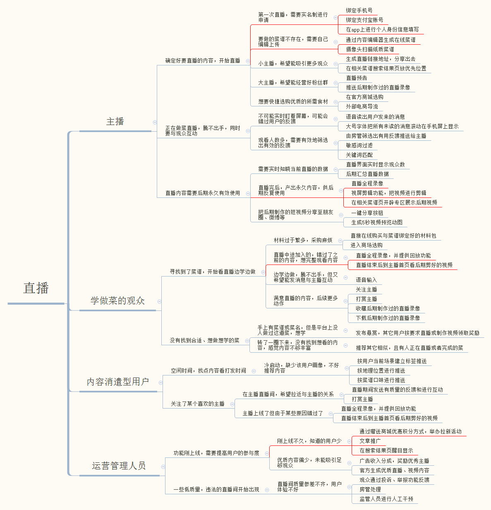

> 题目描述：
>
> 假设你是好豆菜谱新入职的产品助理。在经过多次团队讨论后，为了满足用户更丰富的需求，提升使用体验，你的leader想要在APP里加入【直播】功能。但是具体应该怎么做，肯定需要先分析一下用户的需求。现在领导把这个任务交给了你，让你根据调研用户情况，撰写一份需求分析报告。

好豆荚直播功能需求分析：

直播功能，主播、观众、运营管理缺一不可。由于是刚刚上线，那么对三个角色功能需求的满足程度也有所不同。

在功能上线初期，把吸引到足够的用户放在第一位，丰富、优质的内容和足够的曝光率这么一来应该是现阶段的工作重心。

* 首先主播作为直播内容的生产者，决定了功能起步效果，故需要尽可能地满足其创作需要。
* 对于观众来说，只需其能有途径接触使用直播功能，满足日常观看需求即可。
* 而初期由于直播受众较少，管理较为方便，在监管方面的需求就不是这么急切。那么此时对于运营人员来说应该着重于推广。

按上述原则，提取出当前阶段最靠谱的5个，并进行排序，如下：

1. 完善用户实名制功能，加入支付宝登录支持，同时作为替补方案，加入“完善用户信息”功能和审核流程。
2. 生成直播间短链接功能，并支持分享到主流社交平台。在搜索、内容导航页，给直播内容高优先级显示。
3. 直播录像功能。开发易用的视频编辑器，初期只需要有个剪辑、拼接功能即可，用来编辑直播录像的长视频，同时可以把编辑好的视频挂到菜谱页及主播个人主页上。此时为了保证视频质量需要引入视频审核功能。
4. 直播间拖动进度条进行回放功能。
5. 面向运营人员的活动编辑页，具体功能除了编辑内容，还可以指定文章投放位置和展示权重。