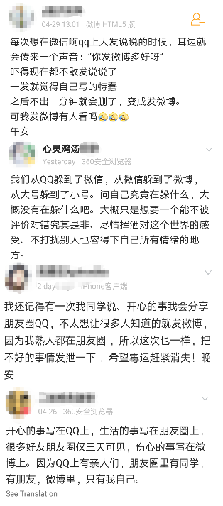

> 题目描述：
>
> 新浪微博、微信朋友圈、QQ动态都具有让个体发布内容的功能，但在产品表现上却不尽相同。
> 请运用课程所学（产品视角、功能理解），结合自己、亲朋、好友的实际体验（用户视角、需求场景），分析对比这些产品在「内容发布」这一功能上的差异，并简要分析其原因。

生活中很多人都会同时使用微博、微信、QQ，三款工具也在不同维度上满足了我们的日常需求。这里主要分析的是三款工具上的信息流发布功能。
#### 谁是大多数
* 微博：用户小鲜肉居多，其中又以90后为主。

* 微信：国民应用，使用人群参考价值不大，但我们这里分析的是朋友圈，所以关注点放在通讯录好友上。

* QQ空间：00 后作为喜欢 QQ 的群体，加上其需求，会更常使用 QQ 空间。同时从个人经验出发，身边认识积极发 QQ 空间的大部分都是 00 后。

QQ 用户性别分布均匀，但其中女性毫无疑问作为主力更爱使用 QQ 空间。

#### 当我们发微博/朋友圈/QQ动态时我们在发什么
先看一张图，截自微博：

虽说上面仅仅是一部分的样本，例如我认识人里也有微博上加了一堆同学，经常在上面互动的。但是从中可以看出大部分人在不同地方发动态的目的是各不相同的。观众不同，决定了内容性质不同。
* 微博：人们（非头部用户），特别是个性十足、自我张扬的 90 后在上面进行情感宣泄、自我表达的地方，吃瓜、追爱豆、晒生活一个都不落。因为发在微博上的东西大部分时候都是陌生人在看，没了现实社交上的压力，所以分享起来顾虑少了，情绪也就越真实。
* 朋友圈：分享日常生活动态、文章转发、求助、营销（包括商品和自己）。朋友圈做为现实生活社交的延续，对个人现实影响也是最大的，在上面发布内容什么都要字字斟酌，因为关乎自己最现实的利益，所以现在有不少人干脆就不发朋友圈或者只显示三天内容，不想累着自己或者减少这方面的风险。可是情绪总是需要地方宣泄的，同时也厌倦了没营养不真实的东西，有人选择了微博，有人选择了 QQ 空间。
* QQ 空间：跟圈子里或关系亲近的人交流爱好、分享生活的地方。就拿 00 后这个群体来说，分享仅限于小群体之间，而且针对不同群体分享的内容也不一样。00 后在心智上还处于成长期，所以对发表的东西目的顾虑也相对简单，融入群体和让自己更让人喜爱。我身边的 00 后就经常发些游戏、搞笑视频和自拍，时不时发表一番似乎阅尽人间沧桑的感想，其实就是想要引起共鸣和刷存在感。
分组功能让上述任何一个软件实现所有对不同观众分享的需求，只是观众聚集的地方不一样。
#### 买买买
讲讲商业模式。
* 微博的商业模式比较多样化。对于普通用户，除了付费会员制外，还有微博问答等付费增值业务。对于头部用户，有粉丝营销管理服务，内容推广服务等。再者对于企业主来说，付费上热搜，业务合作推广，还有再平常不过的启动页广告。真正值钱的还是用户在微博上产生的内容、行为数据。利用这些数据，使企业合作推广更加具有价值，同时通过行为分析把体验不断完善，这样一来充值会员也就给了用户更大的吸引力。这是一个令人充满想象力的资源。
* 微信和 QQ 在信息流模块上的商业模式，主要以广告形式展开。腾讯通过【腾讯社交广告营销平台】，向广告主销售自己的平台资源。其中微信朋友圈广告形态有**本地推广广告**、**原生推广页广告**、**小视频广告图文广告**几种，QQ 空间广告形态有**品牌页卡广告**、**视频故事广告**、**随心互动广告**、**全景交互广告**。广告主通过【广点通数据管理平台】对广告营销进行管理，其中涉及到了用户画像、数据标签体系等等。
#### 发发发
> 微博（国际版）发布面板功能表：

* 微博对图片的个性化编辑是三者里面最好用的，除了原图发送，还可以附上贴纸。整个过程操作简单，并且贴纸内容随发布时间点不同而动态变化，这与用户发送内容类型频繁程度有关，简化常用功能的操作，加快内容生产效率。

* 微博添加的标签是嵌到微博内容里的，这点从微博鼻祖 Twitter 那很好地继承了下来。为什么要这么做呢？我认为出于三点考虑：1、把参与话题与观点放在一起展示，直白明了。2、多条微博以信息流展示出来，在每天微博后加上小尾巴显示标签，浪费空间还不美观，不显示又让人不知所以。3、文本+标签更容易形成广播效应，广告主也可以高效地验证营销效果。
* 在其它地方你只能@通讯录里的好友，但在微博里你可以@任何公众人物，甚至还有可能被爱豆翻牌，提供了小人物与大人物平等交流的一个平台。
* 140字就是微博类应用的卖点，这里就是提醒你注意长度，不过可以发长微博。
* 在发布出一条微博后，可以手动再对该条微博设为部分可见直到仅自己可见。毕竟发在微博上的大部分时候还是给陌生人看的，在控制可见级别上方便许多。
* 微博头部用户还支持对已发布内容进行内容修改，即兼顾内容正确，又维系了粉丝关系。
> 微信朋友圈发布面板功能表：

* 整个微信朋友圈发布功能在三者里是最简单的，该有的基本功能都有，同时在操作上步骤也最短。这可能跟用户发送的内容和场景有关。朋友圈基本都是在分享生活、记录琐碎这种高频操作，且时效性强，把发内容时间成本降到最低，用户才有分享的欲望。例如下午去吃大餐，如果把时间都浪费在了选壁纸上，菜都凉了。
* 支持同步到 QQ 空间，腾讯生态圈的不解释，初期也有好多用户是从 QQ 过来的，能让二者都兼顾，提高了用户的使用意愿。
* 在朋友圈里@了某人之后，那个人的朋友圈图标那会有提示，做到已尽可能小地影响对方的前提下增加双方互动效率。
> QQ 说说发布面板功能表：

* QQ 说说可以说是三这里面功能最为丰富齐全的，而且简单易用，这与 QQ 空间的主要深度用户为 00 后有关。
* 图片跟微博一样可以发原图，而同样是腾讯下的微信却不支持，这可能与 QQ 空间用户已女生居多为主。女生爱发照片爱修图，对图片的质量要求高。
* 可以发 GIF 图，而且还支持相册自动生成，动图增加了内容的趣味性，同时操作还特别简单，这对于爱花样且经验没那么多的 00 后来说吸引力大。
* 字体设置，花里花哨，小学生喜欢，特殊字体还收费，营收又一手段。
* 语音说说，趣味性强，适合时间多的小学生。
* QQ 空间这里的标签跟微博的不一样，这里有个起到一个类别划分的效果，发布后续检索，同时提取出内容信息方便企业主营销。
* 同步到 QQ 个性签名，划过 QQ 好友列表，走过路过的友啊，我新发了条说说，快来看。
* 同步到朋友圈，一家人不解释。
* 定时功能，让你上课时也能发、删说说。
* 打开发布面板，还会根据相机新拍照时间间隔，提供快速插入分享新照片的选项，人性化。