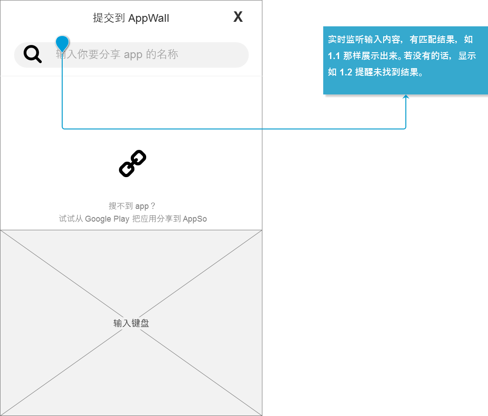
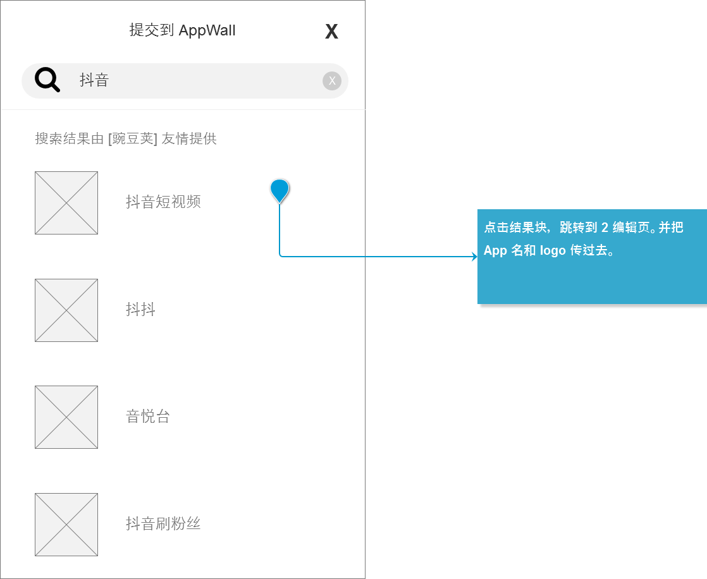
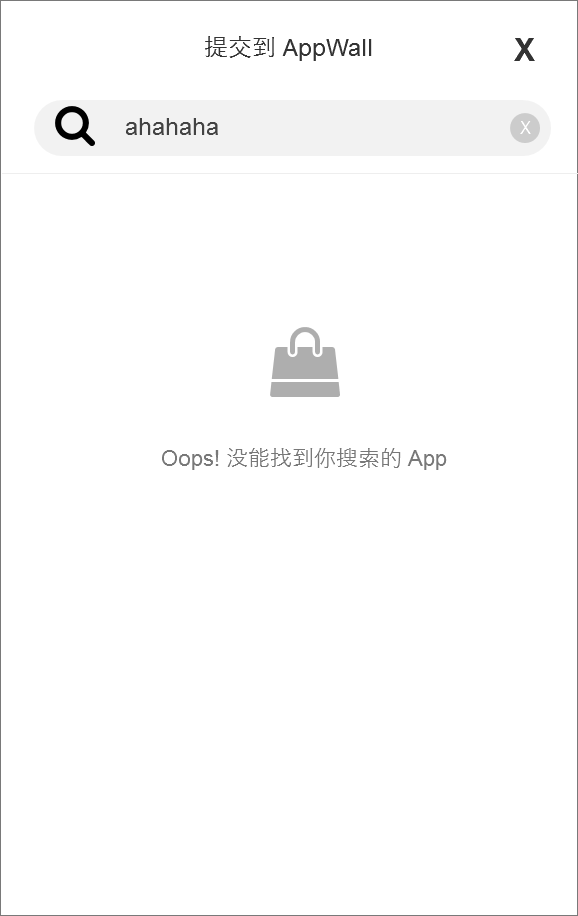
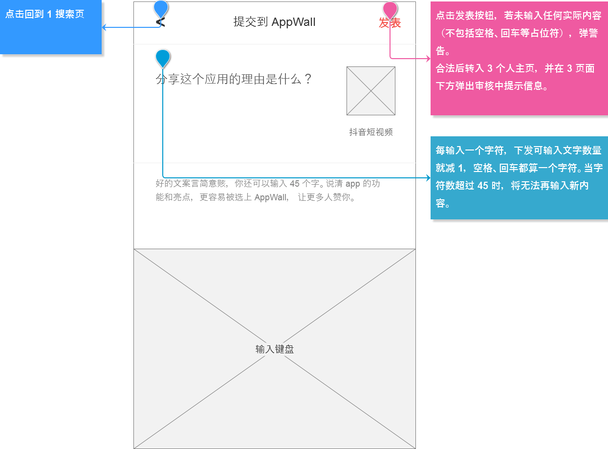
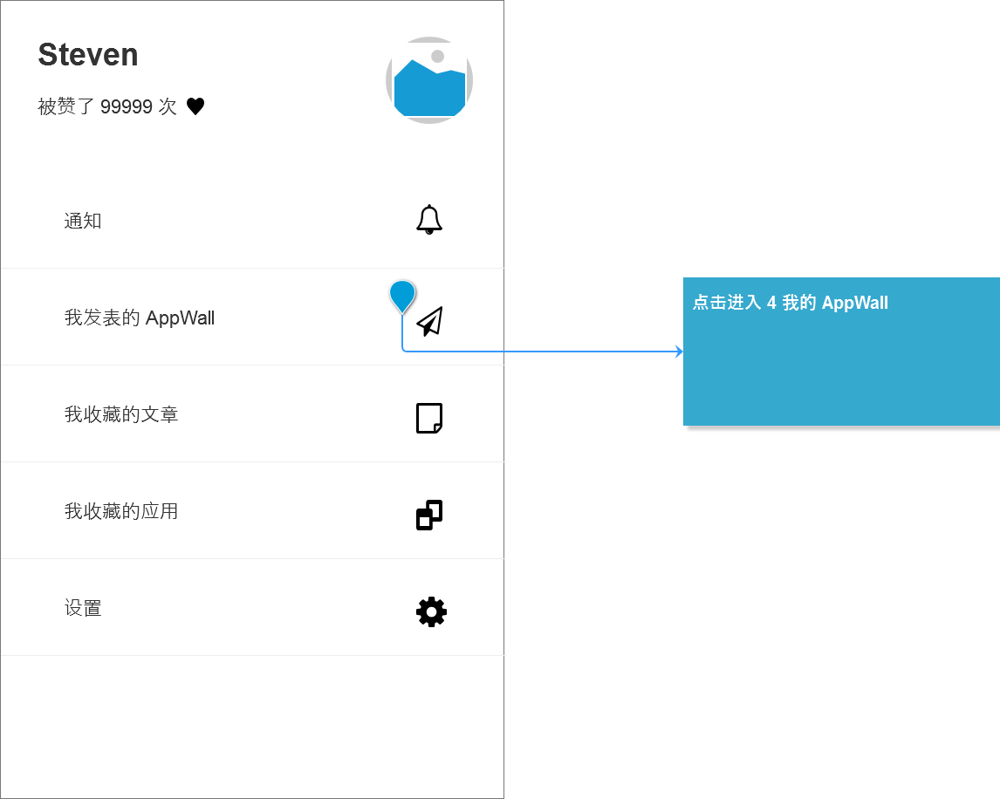
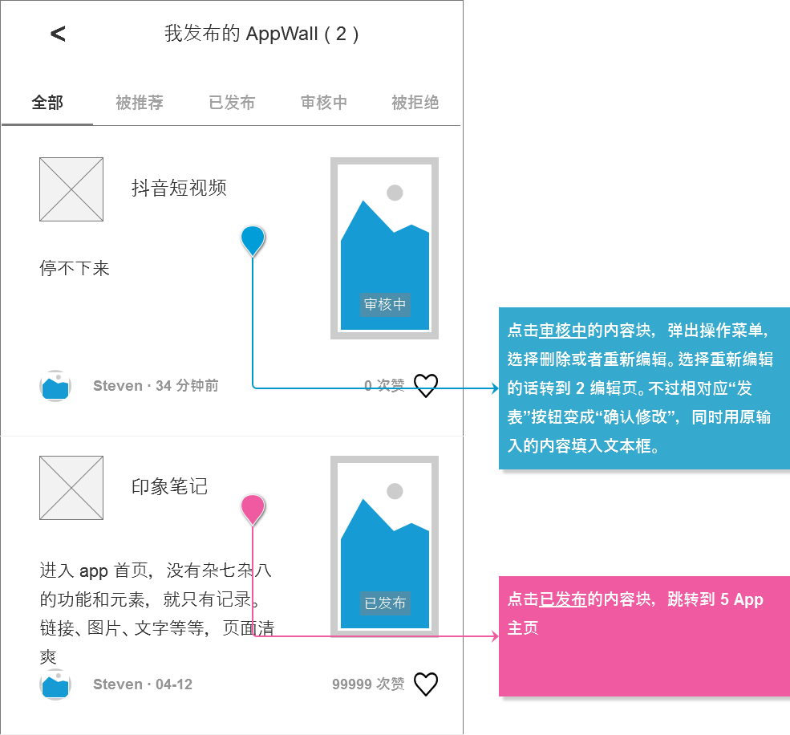
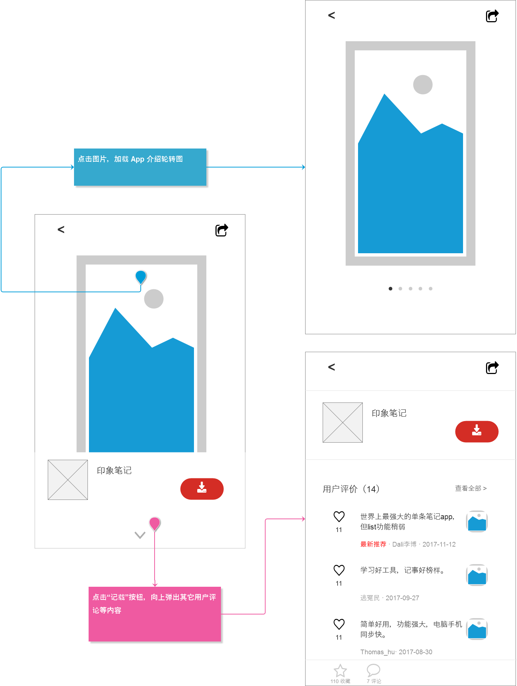

> 题目描述：
>
> 1. 还原页面的所有要素，要求元素必须完整，图片可以使用占位符
> 2. 自己可以提前整理个元件库，为原型绘制时所需的icon做准备
> 3. 在原型中要标注交互信息（即页面跳转的逻辑），若有数据信息也一并梳理出来
> 4. 不要遗漏异常情况的提示/引导

### 1. 搜索页

#### 1.1 结果列表

#### 1.2 无结果

### 2. 编辑页

### 3. 个人主页

### 4. 我的 AppWall

### 5. App in AppWall

