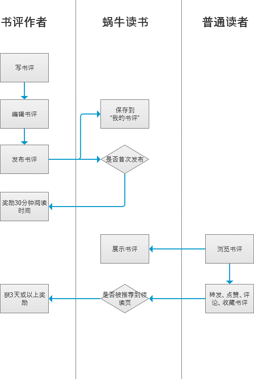

> 题目：
>
> 假如你是微信读书的产品实习生，现在boss希望你对此做认真分析：
>
> 1.简要说明蜗牛读书为什么要做「写书评」板块，这个板块是做什么的？
>
> 2.分析「写书评」功能的业务逻辑
>
> 3.给出你总结的结论

### 体验环境

操作系统：华为荣耀8 Android 7

版本号：v 1.6.1

体验时间：2018-05-28

### 书评之于蜗牛读书的意义

首先书评顾名思义，就是关于一本书的评论，看完一本书后的个人知识输出。

先拿最熟悉的微信读书书评功能说说，在微信读书上写书评，可以被好友看到，书评在这无形中是社交的一种手段，好友写的书评对用户发现内容也有一定的指导作用。但在蜗牛读书这里，社交功能约等于没有，但是书评仍然起着内容发现的作用，不同的是书评作者是一个个陌生人。

回到用户第一次使用蜗牛读书的那一刻，登录进去，领取免费赠送的三本书籍，确定最初的用户画像，自此冷启动完成。

然后读啊读，读完了一本书，有所感想，兴致勃勃洋洋洒洒地写下书评，也算是科学读书，有输入有输出。

又或者读到中间，觉得无聊枯燥了。诶，发现个【领读】页面进去看看大家都在看什么吧。

根据最先建立地用户画像，【领读】页显示了一些用户可能关心的内容，其中包括在读书的书评。

进去在读的书，看看大家看完了都有什么感想。哦，原来是之前没读懂，或者发现原来后面这么精彩，于是又有了读下去的兴致。

但是我的目标是想找新的书看呢？也许我已经放弃了一本书又或者已经读完了现有的书，不可能就放这个 App 在那摆设吧。

在【领读】页，发现一篇感兴趣的文章，是一个不认识人写的书评。

看完作者图文并茂的书评，很有感觉，果断关注，顺便注意到了右上角“只看三本书”的按钮，点进去，发现是自己感兴趣的，接下来又有书看了。

综上，提炼出三点蜗牛读书做书评的理由：

1. 普通读者在读完一本书后做个人记录、输出用，彰显软件专业性。对于专业书评人还是一门可盈利的生意。
2. 陌生用户间纯粹的交流。另一方面也增加用户的黏性和活跃度，书评也是内容消费的一部分。
3. 内容发现和推销，解决书荒用户的读好书需求。

在书评编辑页，可以看到有个“奖励”提示，可见网易对写书评的行为是十分鼓励的。其实网易在内容营销这块也算是老手了，从最开始的网易新闻到最近大热的网易云音乐，都是利用 UCG 内容反哺平台内容，做出了自己的特色。

### 书评功能业务逻辑流程图

### 一些交互上的小亮点

* 在新读完一本书后，如果接下来再手动在【领读】或【我的】页面写书评，会在编辑页的添加书籍区域那弹出该书，就好像新拍完一张照片，再打开微信聊天发送图片可以一键发送新拍好的照片一样，方便写书评引用书籍的操作。
* 在发布按钮的左边，有一个显示奖励规则的按钮，用来告知和鼓励用户创作书评。这个按钮可以说是挺醒目的，不想好多 app 有什么奖励规则这类的还要用专门的页面显示一堆文字。
* 可以插入动态图片，【领读】页动起来了。

### 总结

微信读书和蜗牛读书主要发力点不同：

微信主要靠好友社交来刺激内容的消费，虽然也有平台推荐，但是还是十分有限。

蜗牛读书主要靠平台和社区去卖内容，好友社交功能几乎无。

于是乎蜗牛阅读在用户生成内容环节下的功夫就更多了，同时在商品检索上体验也要好很多，体现在类别齐全上。

微信读书目前用户产生的内容主要还是“想法”这种零散、简洁的内容，在精细和传播潜力上仍有很大的发展空间。

现在微信读书上的公共推文基本都是公众号的上的，都是一个圈子的。虽说用户写的想法都是好友间传播的，但人还是要有梦想的，万一要是实现了呢。

基于以上体验蜗牛读书书评功能和当前微信读书的现状，提出几点参考建议：

* 点评图书（约等于蜗牛读书书评）增加插入图片功能，最好是动图。毕竟动图除了能够使内容表现力更强，还是一种个人性格的展示点。
* 读完一本书后，关闭图书面板后能够展示用户在这本书中写的每一个想法，同时给一个“评价此书”的按钮，用户兴致来了，自然会挥洒文字。
* 点赞数多的点评，能够推送到陌生人那里，给满是公众号推送的列表增添一股清流。