> 题目描述：
>
> 你是多看阅读的产品经理，最近网易蜗牛读书新上线，口碑爆表。你的领导想看看这个产品究竟好在哪里，让你去做分析。
> 请根据课程学习的内容，对 网易蜗牛读书 进行竞品调研，并完成竞品分析报告。

### 蜗牛读书简介
蜗牛读书是网易团队于 2017-02-28 正式上线的一款阅读应用，登录 iOS 和 Android 平台。
Slogan: **每天免费读书一小时**
盈利点：1、购买书籍。2、购买阅读时长。
新颖点：1、领读人账号，相当于传统的小编，不过在这不属于平台。2、领读流问答评论，类似于今日头条的悟空问答，文体属于知乎那种阅读XXX是种怎样的体验。3、共读功能，可以组队看书和共享批注。
### 用户画像
蜗牛读书用户性别年龄分布
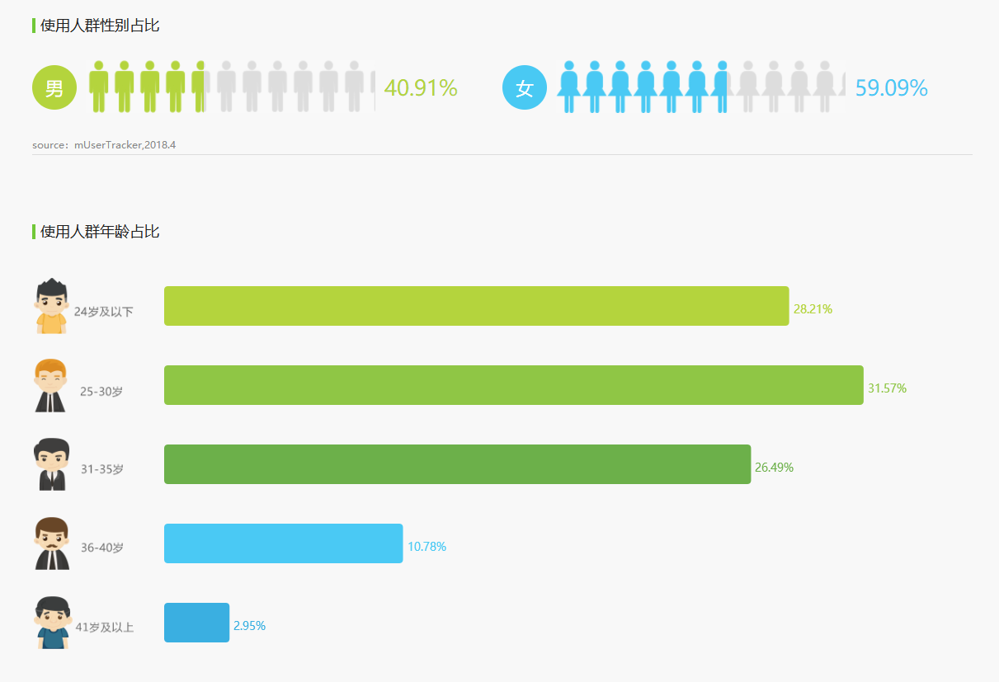
地理位置分布
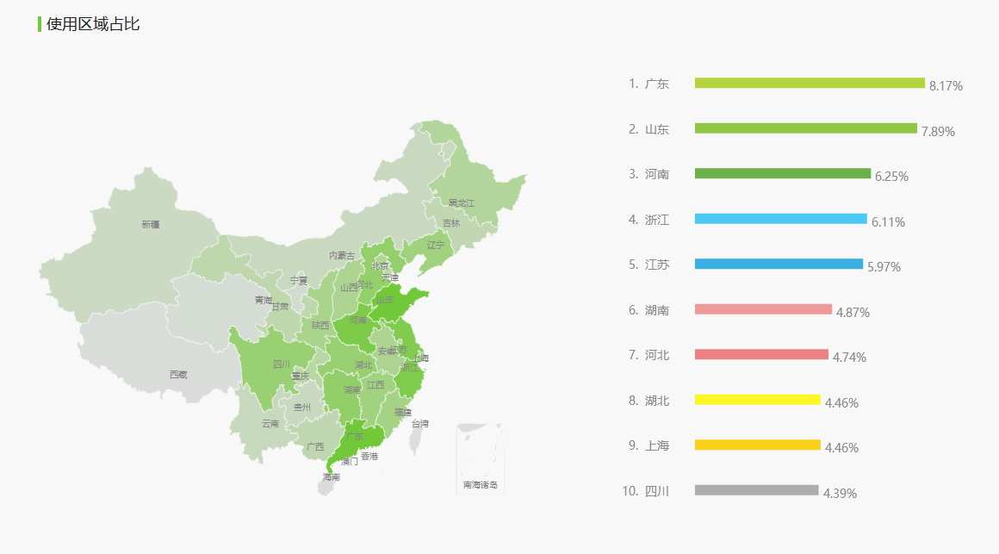
**综上，蜗牛读书主要用户以沿海人口大省的年轻白领为主。**
结合蜗牛读书的自身产品定位和功能，设想出下面几个使用场景：
* 在读大三的小黑，喜欢读一些网络爽文，同时对价格比较敏感。其利用每天蜗牛读书提供的免费 1 小时读书时长，每晚睡前读上那么一会。由于时长有所控制，其休息时间也没耽误多少，还读了不少的爽文。
* 初入职场的小白，一进公司就被要求跟着老同事一起学习产品运营。同事利用蜗牛读书的组队看书功能，带着小白看书入门，同时双方分享读书心得提升对书本的理解。没过几个月小白成功地成为了一只产品运营喵。
* 已经工作 5 年的小蓝，最近看见周围同学一个比一个牛逼，自己陷入了知识焦虑症。其在蜗牛读书上看到了不少领读人分享的优质，在他们的带领下读了不少好书，充实了自己的大脑。
### 产品业务形态
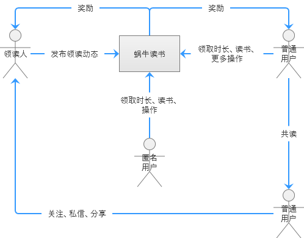
### 主要功能架构
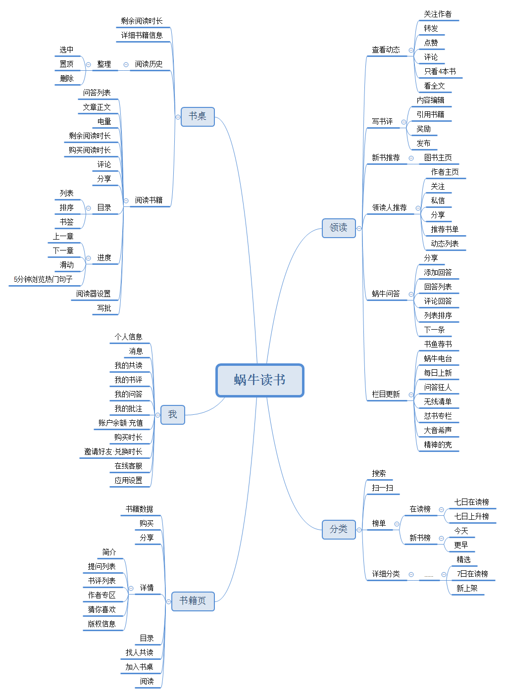
### 版本迭代记录和关键运营点
蓝字为版本更新内容，红字为运营动作。
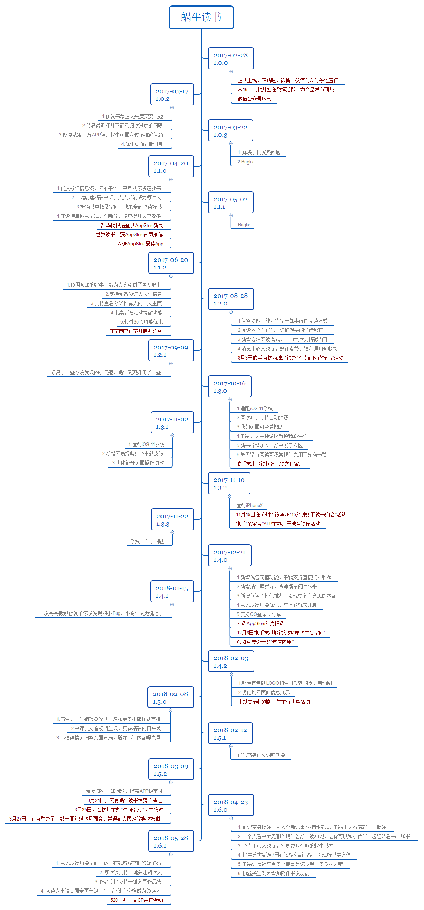
> 根据功能完善程度，可以划分为三个阶段。
> 阶段 1：v1.0.0 ~ v1.0.3，基础功能搭建和完善。达成作为一款合格阅读器的目标。
> 阶段 2：v1.1.0 ~ v1.1.2，推荐机制的建立和完善。开始有了自己的特色和竞争力，市场反应效果良好。
> 阶段 3：v1.2.0 ~ v1.6.1，在功能点上不断尝试推新。此时已经进入了产品功能的迭代良性上升时期。
### 市场表现
酷传统计的 Android 设备总下载量：
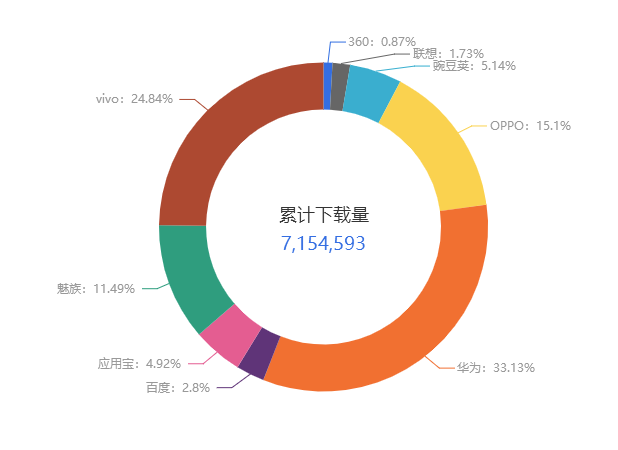
艾瑞数据统计的独立设备数：
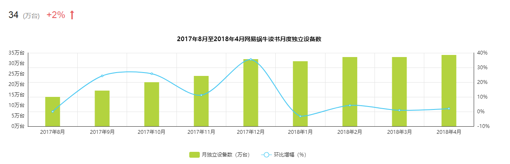
AppStore 排行统计：

加上 17 年获得的大大小小的奖项，蜗牛读书在市场表现这块可圈可点，属于图书阅读器领域的头部玩家，甚至在 2017 年 4 月份刚推出那会排到中国区 AppStore 图书榜的第 4 名。**AppAnnie 上统计的 3530 个用户评分平均达到 4.6 分**。
其市场占有量可能比不上 QQ 阅读器、掌阅（iReader）等老大哥，但是其以其独特的阅读模式和运营打出了自己的市场。
### 一些亮点
下面结合多看阅读现有情况，统计一下在使用蜗牛读书过程中的一些功能、交互或者设计上的亮点：
1. 
> 首先最令人映像深刻的是【领读页】的内容之多样化。【领读页】在这的就是作为一个推荐页用的，对应多看的【书评广场】和各种 PCG 榜单推荐。
> 
> 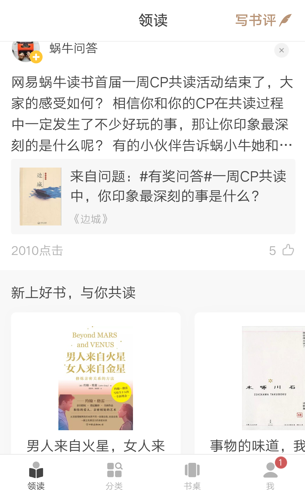
> 
> 蜗牛读书在这点做得比较讨喜的是它的内容形式更加丰富，用信息流的方式呈现。从上面的截图可以看出这里有文字、图片、视频甚至动图等，同时其不同属性的内容是混合在一起的，比如书评后面接的可能是问答或者是榜单推荐，更像在**刷贴吧、微博**。
> 灵活的内容排布，能给用户带来不少的惊喜，因为你永远不知道下一条是什么。
2.
> 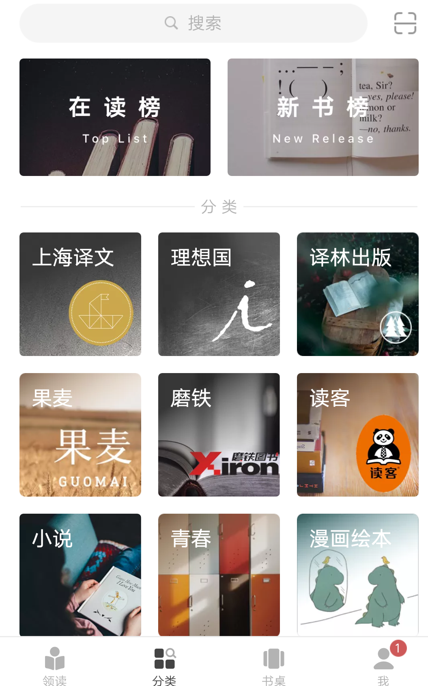
> 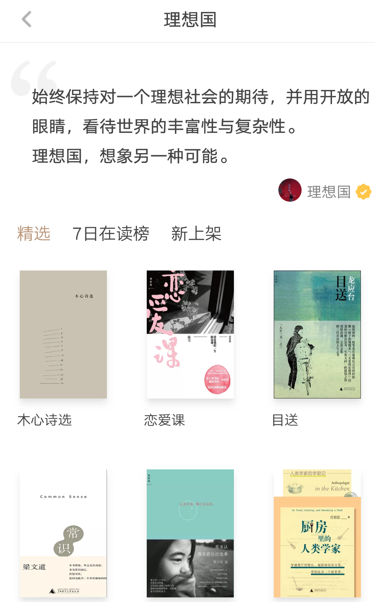
> 上面两幅截图分别是蜗牛读书的【类别】页和【类别详情】页。文艺，同时也简洁，逼格满满。
3.
> 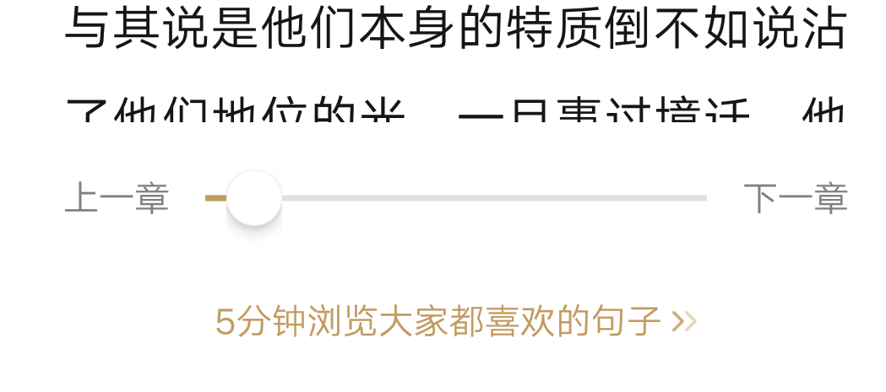
> 在打开进度框时，有个“5分钟浏览大家都喜欢的句子”功能入口。进去后的名字叫“快速阅读”，顾名思义就是让你快速结束这本书，同时也能有所获。
> 在读一本书时，什么情况下才会一直注意页码？这本书未能足够吸引你，但因为某种原因又在逼着自己读。同样在阅读软件上盯着进度条看也有类似的心理。
> 如此一来把重点直接提取出给用户，也算是一种人性化的方式。
### 改进多看阅读
1. 重新组织多看阅读的推荐模块，也就是【书城】，重点突出 UCG 和专题内容，同时能支持更丰富格式的内容，让【书城】**动起来**。总的来说就是做成信息流形式，提升用户的“上瘾程度”，用户停留的时间越长，留给其他应用（最起码是同类）的时间越短，收益也就更好。
2. 重新规划分类列表和标签。完善分类文字措辞，同时精简标签，简化用户操作步骤。现在移动阅读市场已经是一片红海，看重的是用户体验和平台资源。多看作为先入场的选手，在内容丰富度上对比蜗牛读书是占优势的，基于当前多看的情况，接下来需要在用户体验上改进，发挥自身优势。
3. 在进度面板加上一个“查看精句”入口，里面按章节列出用户分享最多的句子。这个需求其实满足的是少部分的需求，这部分人的共同特点是有知识焦虑症，而且占比还不少。为此，在互联网领域耕耘多年的网易推出这个功能肯定是有所考量的，为了能使这部分用户能留存下来，一个应用有用才有人用。但这个功能做好的前提是，用户参与度要高。
4. 增加问答模块。其实问答模块与知识消费领域完美切合。问答从知乎开始流行开来，后面的今日头条也加了进去，并且这部分内容在二者的内容体系里占了很可观的比例，网易相信也是看到了问答模块在读书领域大有可为才加了进来。另一方面也丰富了 UCG 内容类型。对于多看来说，增加问答模块不仅仅是与时俱进，还对增加用户活跃度有积极作用。
5. 增加购买阅读时间付费项。摆脱当前多看有限的变现手段现状，主要目的还是为了刺激消费。