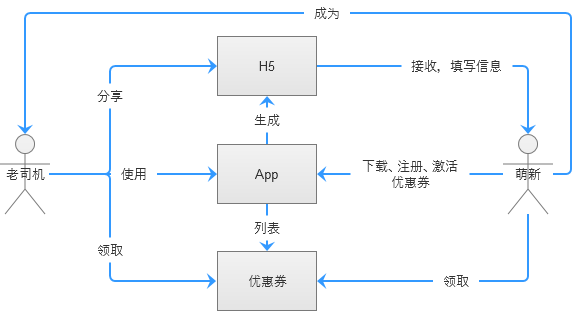

> 题目描述：
>
> 优惠券发放策略设计
> 你是某餐饮类app的产品经理，由于公司推广需求，现在需要设计一个针对新老用户发送优惠券的H5界面，用于微信里用户自发的分享传播。

### 一、需求背景
为了推广 App，用最直接的优惠券活动进行用户拉新和奖励老用户。
考虑到新用户一般是没下 App 的，为了能抵达到新用户，采用 H5 页面的形式传播活动，用于微信里用户自发分享，有聊天窗和朋友圈两种分享形式。
主战场在微信，但是毕竟是别人家的地盘，规矩还是要遵守的。前段时间（针对抖音？）微信团队发布了新的[《微信外部链接内容管理规范》](http://weixin.qq.com/cgi-bin/readtemplate?t=weixin_external_links_content_management_specification)。稍有不慎，直接 GG ！
根据上述规范的第 1.3 条，因为这次需求涉及到了里面提到的虚拟奖品，在分发环节的措辞上需要谨慎，应着重于维护人际关系而非个人经济效益。
同时根据规范第 9.1、9.2 条，需要告知用户所填写信息的用途。
*不落下任何把柄，保障团队辛辛苦苦的劳动成果*。
### 二、需求目的及功能列表
此次需求的可以用一句话描述：**在遵守游戏规则的前提下，老用户分享优惠券到微信里给新用户赢得优惠券领取资格，新用户在领取优惠券并激活后再次分享能再领取一次优惠券**。

* 就优惠券发放环节来说，分**领取**、**分享**两个阶段。
* 角色有**老用户**、**新用户**两种。
* 可以在**应用内**、**H5页面**进行操作。

如此一来有下列使用场景流程：

1. 老用户在 App 或 H5 页面内分享优惠券 H5 页面到微信好友或朋友圈。
2. 老用户在执行完分享操作后，领取优惠券。
3. 在 H5 页面中。新用户填写手机号，并确认是新用户后，将优惠券与手机号关联。接下来引导用户打开或下载应用。
4. 新用户在 App 中注册，注册成功后直接提示优惠券成功激活。
5. 此时的新手已经变成老司机，重复步骤 1。

涉及到的页面与功能如下

|编号|页面|功能点|备注|
|:-:|-|-|-|
|1|启动页|活动海报，带“查看详情”按钮，点击后进入*页面4*||
|2|应用主页|加上活动内容面板，点击后进入*页面4*||
|3|商品详情页|提示有“有可用优惠券可领取”链接，点击后进入*页面4*|只在支持使用优惠的商品中显示|
|4|活动详情页|有活动规则说明。功能分配：1.没在H5页面登记过的新用户，可以领取优惠券和分享到微信，分享到微信成功后可以再领取一次优惠券。2.在H5页面登记过的新用户可以分享到微信，并领取一次优惠券。3.没领取过优惠券的老用户可以在分享成功后领取一次优惠券。4.领取过因分享而产生优惠券的用户在分享后不再有优惠券奖励。|在活动开始后才注册的用户都属于新用户|
|5|成功分享后领取优惠券页面|提示优惠券领取成功，并给出一个链接“去使用”，点击后打开可用商品列表||
|6|分享的优惠券激活提示框|提示优惠券激活成功，并给出一个链接“去使用”，点击后打开可用商品列表。还显示“分享给更多人”按钮，分享成功后再领一次优惠券，转*页面5*|用在新用户注册后激活优惠券的场景，在登录时弹出提示|
|7|优惠券列表页|按过期时间顺序排列|点击“去使用”按钮，打开可用商品列表|

### 三、流程设计
发放优惠券业务逻辑

发放优惠券业务流程
* App 内领取、分享、激活优惠券

* 新用户在 H5 页面内领取优惠券

* 新用户注册激活优惠券

发放优惠券页面流程

### 四、功能详细介绍
目录（注：页面编号与**需求目的及功能列表**中的有所**不同**）

* 启动页（页面1）

* 活动详情
（页面2）

（页面3）

（页面4）

* 优惠券列表（页面5）

### 五、考核指标与计算
此次活动目的在于吸引新用户和活跃老用户，所以指标上看的是人而不是销售额。同时要明确每次活动的目的，不是为了当前冲个数量就完事了，主要还是要看后面的效果怎样，暂且把数据范围定在活动开始的前中后三个月。
按这个思路，分两个方面去考量：新用户加入情况怎样？老用户激活情况怎样？
那怎样才算新用户成功加入？答，找到在活动月领取了优惠券，且下个月有消费记录的新用户数，占活动月有领取优惠券新用户的比值。即**新用户激发活跃比**。
老用户成功激活的标志呢？答，看活动前一个月没有消费记录，但活动月有领取优惠券的动作（无论消费与否），且下个月还有消费记录的老用户数，与活动月的上个月和下个月无消费记录老用户数的比值。即**老用户转化活跃度**；

概念：
* 新用户：注册日期大于活动开始日期的用户
* NU：有领取该活动优惠券的新用户量
* NUA[ctivate]：下个月有消费记录的新用户量
* OUG[ood]：前一个月没有消费记录，活动月有领取优惠券下个月还有消费记录的老用户量
* OUB[ad]：活动月的上个月和下个月无消费记录老用户量

算法：
* 新用户激发活跃比(NA[activate]E[ffect]) = NU / NUA
* 老用户转化活跃度(OAE) = OUG / OUB
* 综合值(C[omprehension]) = NAE * OAE

考核：
* NAE 大于 0.3，说明有成功有效转化了 30% 的领券新用户，可以评价为效果不错
* OAE 大于 1，说明有成功有效激活了原来一半的老用户，可以评价为效果不错
* C 值以 0.3 为及格线，0.7 为良好线，1.0 为优秀线。数值越大越好

埋点：
* 每一个属于新用户的电话号在通过 H5 页面成功领取券，和在 App 活动页内成功领取券后，NU + 1
* 下个活动月，一旦用户有消费，NUA + 1
* 有老用户通过分享得到券后，并且其前个月没消费，下个月有消费，OUG + 1
* 有老用户上个月和下个月都没消费，OUB + 1

*所有数据在活动月的下个月月底进行统计，并导出 Excel 报表。*

### 六、后续发展
一款好的产品就应该能给使用者和制造者带来好处。
对于用户来说，花最少的代价满足更多的需求就是赚到。这里的代价包括价钱、时间、地理、选择成本，需求包括生理（吃）、社交需求。
对于公司平台来说（特别是互联网领域），产品能吸引更多的用户，除了最表面上的的营业额上升（有时还不一定），变现想象空间也会随之上升，推动市值上涨。促进用户活跃度，还能建立起自己的护城河。
所以后面的主要工作，除了不断在运营手段上吸引更多新用户的加入，更重要的是不断提示自身的服务。靠补贴引课是现在不少互联网公司常用的手段，但是如果用户忠诚度没培养起来，最终只能是破财而已。
提供更多商品，改进用户体验，不断迭代产品，才是重中之重！
